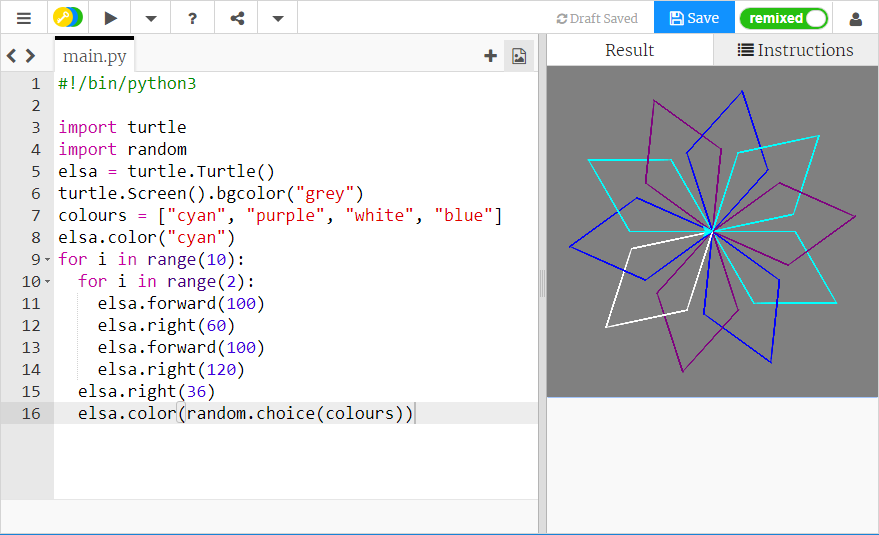

## تغيير لون القلم عشوائياً

حتى الآن ، كانت السلحفاة ترسم خطوطًا سوداء على خلفية بيضاء. الآن حان الوقت لإضافة لون!

- لتعيين لون السلحفاة ، حرك مؤشر الماوس الى السطر الذي قمت بتسمية سلحفاتك وقبل التعليمة البرمجية تكرار، واكتب ما يلي:

```python
elsa.color("cyan")
```

**ملاحظة**: يختلف تهجئة "اللون colour" في البلدان الأخرى. في الولايات المتحدة ، تم تهجئتها بـ'color' ، وفي Python يجب أن يتم تهجئة بالطريقة الأمريكية لتعمل.

لقد اخترت استخدام اللون الازرق الفاتح **cyan**، ولكن يمكنك استخدام أي لون من هذه القائمة:

- أزرق "blue"
- أرجواني "magenta"
- اللون الرمادي "grey"
- بنفسجي "purple"

يمكنك أيضا تغيير لون نافذة الخلفية. لتعيين لون الخلفية، استخدم هذه التعليمات أسفل التعليمات البرمجية التي كتبتها للتو:

```python
turtle.Screen().bgcolor("blue")
```


من أجل المتعة ، يمكنك إضافة لون عشوائي لسلحفاتك ، بحيث تحصل في كل مرة تقوم فيها بتشغيل التعليمات البرمجية ، على رقاقة ثلج مختلفة قليلاً.

- أولاً سوف تحتاج إلى استيراد مكتبة `random` أدناه: `mport turtle`، اكتب `import random`.

- بعد ذلك ، قم بتغيير لون الخلفية من`"blue"` إلى `"grey"`.

- أسفل هذا السطر ، قم بإنشاء متغير يسمى ` colours ` لتخزين قائمة الألوان التي يمكن الاختيار منها، مثل هذا:
    
    ```python
    colours = ["cyan", "purple", "white", "blue"]
    ```

- في نهاية التعليمة البرمجية تكرار ، وتحت `elsa.right(36)`، اكتب:
    
    ```python
    elsa.color(random.choice(colours))  
    ```
    
    ** ملاحظة **: تأكد من وجود مسافة بادئة لهذا السطر أيضًا ، حتى يعرف برنامجك أنه داخل الحلقة التكرارية.

- حفظ وتشغيل التعليمات البرمجية الخاصة بك للثلج متعدد الألوان!



## \--- collapse \---

## title: المزيد من الألوان

هناك الكثير من الألوان التي يمكنك الاختيار من بينها! ألق نظرة على [هذا الموقع](https://wiki.tcl.tk/37701) للحصول على قائمة كاملة.

\--- /collapse \---