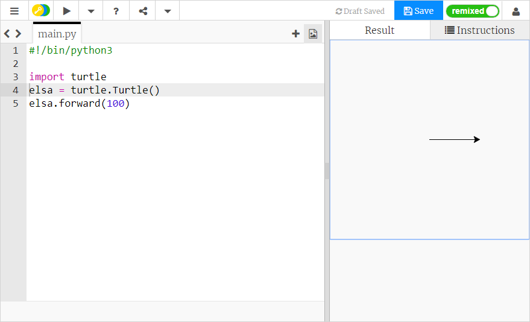

## Comment dessiner avec Turtle de Python

+ Ouvre le [modèle trinket vide Python ](http://jumpto.cc/python-new).

+ Tape le texte suivant dans la fenêtre qui apparaît :
    
    
    
    La ligne `#!/bin/python3` précise à ton ordinateur que nous utilisons Python 3 (la version la plus récente).

+ Pour commencer à utiliser Turtle en Python, tu dois importer la bibliothèque Turtle. En haut de la fenêtre de l'éditeur de texte, tape `import turtle`.

+ Il est temps de donner un nom à ta « tortue » ! Tu peux utiliser une variable pour faire cela. Je nomme ma « tortue » `elsa`, mais tu peux nommer la tienne comme bon te semble.
    
    ```python
    elsa = turtle.Turtle()
    ```

+ Maintenant tu peux dire à ta tortue quoi faire, par exemple, avancer de `100`. Fais un essai !
    
    ```python
    elsa.forward(100)
    ```

+ Clique sur **Run** pour exécuter ton premier programme Turtle. Que se passe-t-il ?
    
    

**Tu n'as pas besoin de compte Trinket pour sauvegarder tes projets !**

Si tu ne disposes pas d'un compte Trinket, clique sur la flèche vers le bas, puis sur **Lien** . Cela te donnera un lien que tu peux enregistrer pour revenir plus tard. Rappelle-toi que tu devras le faire chaque fois que tu apporteras des modifications à ton code, car le lien changera !


Si tu as un compte Trinket, tu pourras cliquer sur **Remix** pour enregistrer ta propre copie.