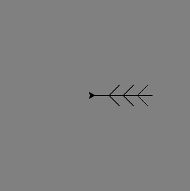

## Utiliser une fonction pour dessiner un flocon de neige

Ton flocon de neige en parallélogramme est cool, mais il ne ressemble pas à un flocon de neige comme il le pourrait. Réglons donc ça !

Pour ce dessin, nous devons déplacer la « tortue » du centre de la fenêtre. Les instructions `penup()` et `pendown()` nous permettent de le faire sans tracer une ligne, Tout comme prendre un vrai stylo sur le papier et le déplacer ailleurs pour commencer à écrire.

- Tape les instructions suivantes sous la liste `colours` :
    
    ```python
    elsa.penup()
    elsa.forward(90)
    elsa.left(45)
    elsa.pendown()
    ```

Écris le code pour dessiner une branche d'un flocon de neige et le stocker dans une **fonction**. Ensuite, tu peux simplement le répéter encore et encore pour créer un flocon de neige complet.



- Définis une fonction appelée `branch` en tapant :
    
    ```python
    def branch ():
    ```

- Supprime le code des boucles de flocon parallélogramme. Ajoute le code suivant indenté dans la fonction `branch` :
    
    ```python
    for i in range(3):
        for i in range(3):
            elsa.forward(30)
            elsa.backward(30)
            elsa.right(45)
        elsa.left(90)
        elsa.backward(30)
        elsa.left(45)
    elsa.right(90)
    elsa.forward(90)
    ```
    
    **Note** : N'oublie pas que l'indentation est importante. Assure-toi de vérifier que toute ton indentation est correcte, sinon ton code ne fonctionnera pas !

- Écris une dernière section de code pour **appeler** la fonction `branch` (qui signifie l’exécuter) huit fois. Tu peux utiliser une boucle à nouveau comme pour ton dernier flocon de neige :
    
    ```python
    for i in range(8):
      branch()
      elsa.left(45)
    ```

- Mets un `#` au début de `elsa.color(random.choice(colours))` pour le transformer en un **commentaire**. Cela signifie que l'ordinateur sautera cette ligne de code. Tu peux supprimer la ligne, mais tu pourrais l'utiliser pour ajouter de la couleur à ton flocon de neige plus tard.

- Enregistre et exécute ton code, et un flocon de neige devrait apparaître sous tes yeux !

