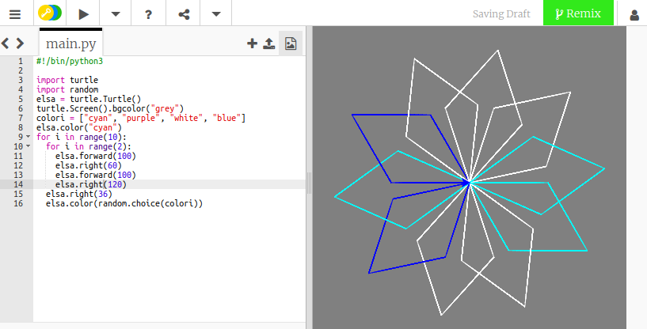

## Cambiare il colore della penna in modo casuale

Finora la tartaruga ha disegnato linee nere su uno sfondo bianco. Ora è il momento di aggiungere colore!

- Per impostare il colore della tartaruga, sposta il cursore sotto il nome della tartaruga poco prima dei tuoi cicli e digita quanto segue:

```python
elsa.color("cyan")
```

** Nota **: L'ortografia della parola "colore" è diversa nei vari paesi. Negli Stati Uniti si scrive 'color' e in Python si utilizza l'ortografia americana.

Ho scelto di usare il colore **cyan** (ciano), ma puoi utilizzare qualsiasi altro da questo elenco:

- "blue"
- "magenta"
- "grey"
- "purple"

Puoi anche cambiare il colore dello sfondo della finestra. Per impostare il colore dello sfondo, inserisci queste istruzioni sotto il codice che hai appena scritto:

```python
turtle.Screen().bgcolor("blue")
```


Per divertimento puoi aggiungere un colore casuale per la tua tartaruga, in modo che ogni volta che esegui il codice, otterrai un fiocco di neve leggermente diverso.

- Per prima cosa dovrai importare la libreria `random`: sotto `import turtle`, digita `import random`.

- In seguito, cambia il colore di sfondo da `"blue"` a `"grey"`.

- Sotto quella linea, crea una variabile chiamata `colori` per memorizzare un elenco di colori tra cui selezionare, in questo modo:
    
    ```python
    colori = ["cyan", "purple", "white", "blue"]
    ```

- Alla fine del ciclo annidato, sotto `elsa.right (36)`, digita:
    
    ```python
    elsa.color(random.choice(colori))  
    ```
    
    **Nota**: assicurati che anche questa riga sia rientrata, in modo che il tuo programma sappia che è all'interno del ciclo.

- Salva ed esegui il tuo codice per creare un fiocco di neve multicolore!



## \--- collapse \---

## title: Altri colori

Ci sono molti più colori tra cui puoi scegliere! Dai un'occhiata a [questo sito web](https://wiki.tcl.tk/37701) per un elenco completo.

\--- /collapse \---