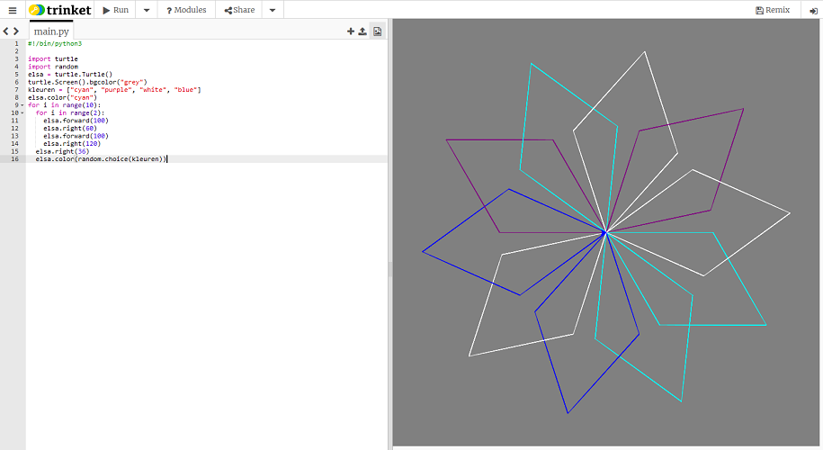

## De penkleur willekeurig wijzigen

Tot dusver tekende de schildpad zwarte lijnen op een witte achtergrond. Nu is het tijd om kleur toe te voegen!

- Om de kleur van de schildpad in te stellen, beweeg je je cursor naar beneden waar je je schildpad een naam hebt gegeven en nog voor je lussen, en typ het volgende:

```python
elsa.color("cyan")
```

**Opmerking**: De spelling van 'color' is verschillend in andere landen. In de VS wordt het als 'color' gespeld en in Python moet het op de Amerikaanse manier worden gespeld.

Ik heb ervoor gekozen om de kleur **cyan (cyaan)** te gebruiken, maar je kunt alles uit deze lijst gebruiken:

- "blue" (blauw)
- "magenta"
- "grey" (grijs)
- "purple" (paars)

Je kunt ook de kleur van het achtergrondvenster wijzigen. Gebruik deze instructie onder de code die je zojuist hebt geschreven om de achtergrondkleur in te stellen:

```python
turtle.Screen().bgcolor("blue")
```


Voor de lol kun je een willekeurige kleur voor je schildpad toevoegen, zodat je elke keer dat je je code uitvoert een iets andere sneeuwvlok krijgt.

- Eerst moet je de `random` bibliotheek importeren: onder `import turtle`, typ `import random`.

- Verander vervolgens de achtergrondkleur van `"blue"` naar `"grey"`.

- Onder die regel maak je een variabele met de naam `kleuren` om een lijst met de kleuren op te slaan waaruit je kunt kiezen, zoals dit:
    
    ```python
    kleuren = ["cyan", "purple", "white", "blue"]
    ```

- Aan het einde van de spiraallus, onder `elsa.right(36)` typ:
    
    ```python
    elsa.color(random.choice(kleuren))  
    ```
    
    **Opmerking**: zorg ervoor dat deze regel ook is ingesprongen, zodat je programma weet dat het in de lus zit.

- Sla je code op en voer uit voor een meerkleurige sneeuwvlok!



--- collapse ---
---
title: Meer kleuren
---

Er zijn veel meer kleuren waaruit je kunt kiezen! Neem een kijkje op [deze website](https://wiki.tcl.tk/37701) voor een volledige lijst.

--- /collapse ---