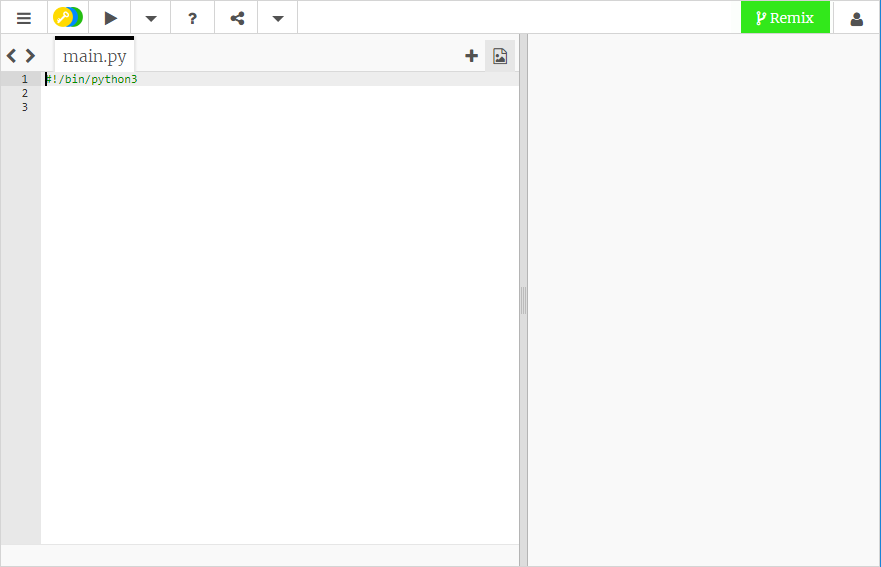

## How to draw with Python Turtle

+ Open the [blank Python template trinket](http://jumpto.cc/python-new).

+ Digite o seguinte na janela que aparece:
    
    
    
    The line `#!/bin/python3` just tells your computer that we're using Python 3 (the latest version of Python).

+ To begin using Turtle in Python, you need to import the Turtle library. At the top of the text editor window, type `import turtle`.

+ Time to give your turtle a name! You can use a variable to do this. I'm naming my turtle `elsa`, but you can name yours whatever you like.
    
    ```python
    elsa = turtle.Turtle()
    ```

+ Now you can tell your turtle what to do, for example, to move forward `100`. Give it a go!
    
    ```python
    elsa.forward(100)
    ```

+ Click on **Run** to run your first Turtle program. O que acontece?
    
    

**Você não precisa de uma conta Trinket para salvar seus projetos!**

Se você não tiver uma conta do Trinket, clique na seta para baixo e, em seguida, clique em **Link**. Isso lhe dará um link que você pode salvar e voltar mais tarde. Just remember that you'll need to do this every time you make changes to your code, as the link will change!


Se você tem uma conta Trinket, você pode clicar **Remix** para salvar sua própria cópia do trinket.