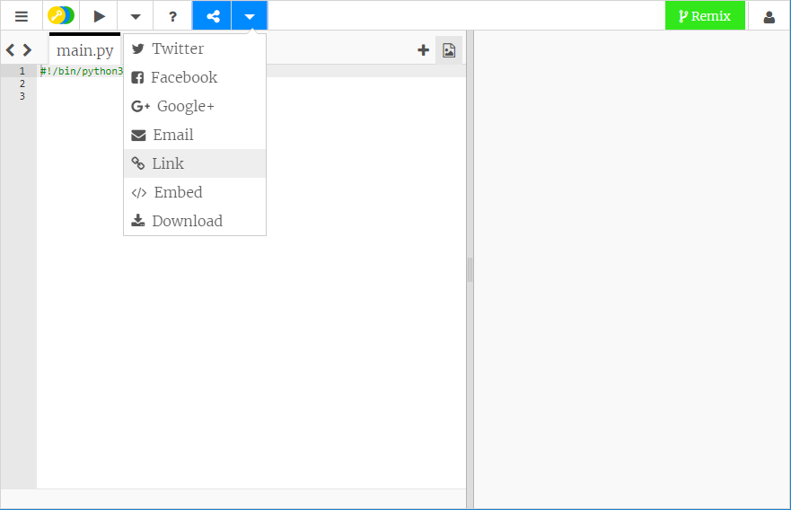

## How to draw with Python Turtle

+ Open the [blank Python template trinket](http://jumpto.cc/python-new).

+ Introduceți următoarele în fereastra care apare:
    
    
    
    The line `#!/bin/python3` just tells your computer that we're using Python 3 (the latest version of Python).

+ To begin using Turtle in Python, you need to import the Turtle library. At the top of the text editor window, type `import turtle`.

+ Time to give your turtle a name! You can use a variable to do this. I'm naming my turtle `elsa`, but you can name yours whatever you like.
    
    ```python
    elsa = turtle.Turtle()
    ```

+ Now you can tell your turtle what to do, for example, to move forward `100`. Give it a go!
    
    ```python
    elsa.forward(100)
    ```

+ Click on **Run** to run your first Turtle program. Ce se itampla?
    
    

**Nu aveți nevoie de un cont Trinket pentru a vă salva proiectele!**

Dacă nu aveți un cont Trinket, dați click pe săgeată-jos și, mai apoi, pe **Link**. Acest lucru vă va oferi un link pe care îl puteți salva și la care puteți reveni mai târziu. Just remember that you'll need to do this every time you make changes to your code, as the link will change!



Dacă aveți un cont Trinket, puteți da click pe **Remix** pentru a vă salva propria copie a trinket-ului.