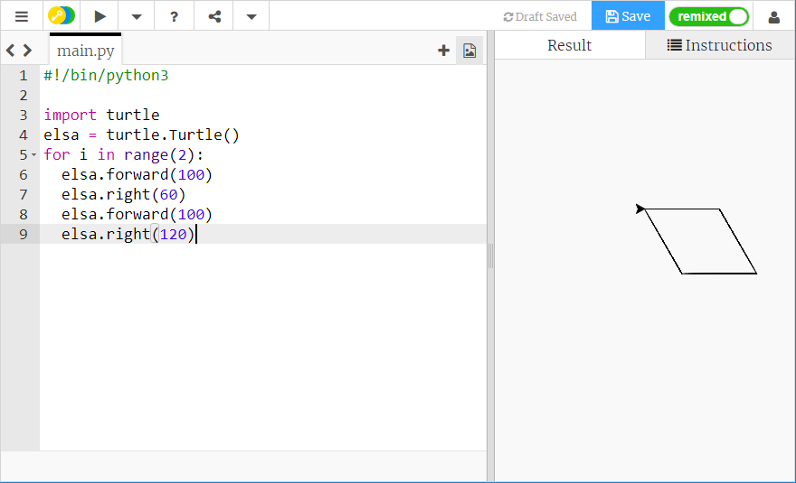

## Створення візерунків для сніжинок

Досить квадратів! Давай намалюємо якісь інші фігури і повторюватимемо їх, щоб вийшла сніжинка.

- Заміни код для квадрата наступним:
    
    ```python
    for i in range(2):
      elsa.forward(100)
      elsa.right(60)
      elsa.forward(100)
      elsa.right(120)
    ```
    
    Так ти намалюєш фігуру, що називається паралелограм. Ти можеш побачити, як вона виглядає, якщо збережеш і запустиш код.
    
    

Можна розміщувати цикли всередині інших циклів. Це нам підходить, тому що ми можемо це використати, щоб намалювати сніжинку.

- Над рядком `for i in range(2):` для паралелограма, введи:
    
    ```python
    for i in range(10):
    ```
    
    Скільки разів виконується цей цикл?

- Переведи курсор в рядок під своїм кодом і натисни клавішу пропуск два рази, щоб зробити **відступ** в коді, який ти збираєшся написати. В Python відступи дуже важливі для того, щоб твій код працював, як ти очікуєш! Тепер введи:
    
    ```python
    elsa.right(36)
    ```

- Збережи та запусти свій код, щоб побачити, що відбудеться. Ти маєш побачити таке зображення:
    
    