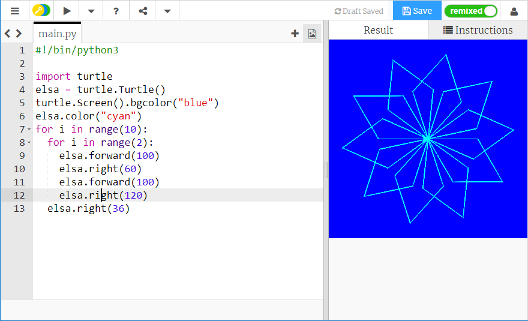

## 隨意地更改筆的顏色

到目前為止，您的烏龜在白底上繪製許多黑線， 是時候添加新色彩了！

- 要設置烏龜的顏色，將遊標移動到您命名烏龜指令的下方和迴圈之前，然後輸入以下內容：

```python
elsa.color("cyan")
```

**注意** ：“顏色”的拼寫在其他國家/地區有所不同。 在美國，它被拼寫為“color”，而在Python中，它必須以美語拼寫。

我選擇使用青色**cyan** ，而您可以使用下列的任何一個：

- 藍色 "blue"
- 紫紅色 "magenta"
- 灰色 "grey"
- 紫色 "purple"

您也可以更改背景視窗的顏色。 請在您剛剛編寫的代碼下方依照以下指令來設置背景顏色：

```python
turtle.Screen().bgcolor("blue")
```



有趣的是您可以為烏龜加上隨機的顏色，如此一來當您每次運行代碼時，都會得到不同的雪花。

- 首先您需要導入`random`函式庫：在`import turtle`下一行，輸入`import random` 。

- Next, change the background colour from `"blue"` to `"grey"`.

- Below that line, create a variable called `colours` to store a list of the colours to select from, like this:
    
    ```python
    colours = ["cyan", "purple", "white", "blue"]
    ```

- At the end of the spiral loop, below `elsa.right(36)`, type:
    
    ```python
    elsa.color(random.choice(colours))  
    ```
    
    **Note**: make sure this line is also indented, so that your program knows it's within the loop.

- Save and run your code for a multi-coloured snowflake!


## \--- collapse \---

## title: More colours

There are a lot more colours you can choose from! Have a look at [this website](https://wiki.tcl.tk/37701) for a complete list.

\--- /collapse \---